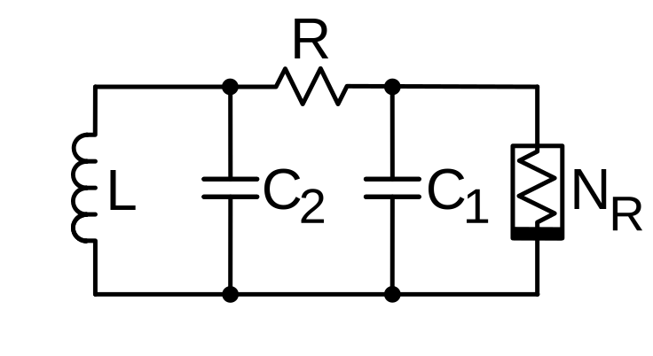
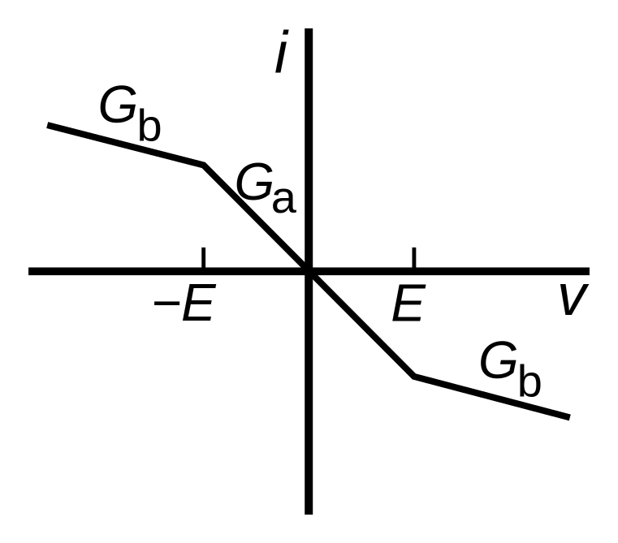

# Modeling Chua's Circuit using a Neural Ordinary Differential Equation

April Herwig

March 2023

## Introduction

Chua's circuit is a standard case study in the literature on chaotic dynamics [9]. The simplicity of the mathematical model, a non-stiff three-dimensional system of ordinary differential equations, makes it an attractive example for many numerical experiments. The goal of this project is to train a neural ordinary differential equation using trajectory data, and determine a (heuristic) minimal amount of data required to obtain a satisfying model. 

Chua's circuit was initially developed in 1986 with the goal (among others) to determine whether chaotic dynamics can appear in real-life continuous dynamical systems, or if chaos could only exist in mathematical abstraction [4]. Indeed, a strange attractor observed in experiment [10], matching the one observed through numerical simulation. 

A schematic diagram of the simplest canonical Chua's circuit is given in the below figure [2]. It consists of four components connected in parallel: two capacitors (``C_1`` and ``C_2``) with a resistor ``R`` connected between them, as well as an inductor ``L`` and a _nonlinear negative resistance_ component ``N_R`` called a _Chua diode_ [8]. 



Using Kirchoff's laws one derives a set of equations for the three energy storing components. After nondimensionalization the system can be written in a (simplified) canonical form [5]
```math
\begin{cases}
    \dot{x} &= \alpha \left( y - m_0 x - m_1 f(x) \right) \\
    \dot{y} &= x - y + z \\
    \dot{z} &= - \beta y . 
\end{cases}
```
where ``\alpha, \beta, m_0, m_1`` are real paramters and ``f`` is a nonlinear function with fixed point ``0``. Note that aside from ``f``, the system is entirely linear and hence will not exhibit chaotic behavior. The original Chua oscillator used a piecewise linear function representing the diode's resistance graph, shown below [3]. However, many simpler (and smoother) functions still exhibit chaotic dynamics while being more suitable for convergence proofs of numerical algorithms. This project will use a cubic nonlinearity ``f(x) = \frac{1}{3} x^3`` with parameters ``\alpha = 18,\ \beta = 33,\ m_0 = -0.2,\ m_1 = 0.01``.



The Chua oscillator exhibits a strange attractor referred to as the double scroll, as well as a surrounding periodic orbit. These can be initially supposed by observing long trajectories beginning around the two unstable fixed points ``x_\pm = \left( \pm \sqrt{-3 m_0 / m_1},\ 0,\ \mp \sqrt{-3 m_0 / m_1} \right)^T``. 


```@example 1
using GLMakie
```

```@example 1
# for plotting phase portraits
function chua_axis(; aspect=(1,1.2,1), azimuth=pi/10)
    fig = Figure()
    ax = Axis3(fig[1,1], aspect=aspect, azimuth=azimuth)
    fig, ax
end
```

```@example 1
using StaticArrays, OrdinaryDiffEq
```

```@example 1
# Chua's circuit
function v(u, p, t)
    x, y, z = u
    a, b, m0, m1 = p
    SA{Float32}[ a*(y-m0*x-m1/3.0*x^3), x-y+z, -b*y ]
end

# parameters
p_ode = SA{Float32}[ 18.0, 33.0, -0.2, 0.01 ]
a, b, m0, m1 = p_ode

v(u) = v(u, p_ode, 0f0)

# equilibrium
x₊ = SA{Float32}[ sqrt(-3*m0/m1), 0, -sqrt(-3*m0/m1) ]
x₋ = -x₊

# integration time
t0, t1 = 0f0, 40f0
tspan = (t0, t1)
dt = 1f-2
```

```@example 1
x0 = SA{Float32}[2, 1.5, 6]
prob = ODEProblem(v, x0, (t0, t1), p_ode)
sol = solve(prob, RK4(), saveat=dt)
```

```@example 1
fig, ax = chua_axis()
scatter!(ax, [x₊, SA[0f0,0f0,0f0], x₋], color=:red, label="Equillibria")
lines!(ax, sol.u, label="Inner Attractor")
Legend(fig[1,2], ax)

save("inner.png", fig); nothing # hide
```


```@example 1
x0 = SA{Float32}[2, 1.5, 6]
prob = ODEProblem(v, x0, (t0, t1), p_ode)
sol = solve(prob, RK4(), saveat=dt)

fig, ax = chua_axis()
scatter!(ax, [x₊, SA[0f0,0f0,0f0], x₋], color=:red, label="Equillibria")
lines!(ax, sol.u, label="Inner Attractor")

# only slightly different initial condition
x0 = SA{Float32}[2, 1.5, 8]
prob = ODEProblem(v, x0, (t0, t1), p_ode)
sol = solve(prob, RK4(), saveat=dt)

lines!(ax, sol.u, color=:green, label="Outer Attractor")
Legend(fig[1,2], ax)

save("outer.png", fig); nothing # hide
```


The existence of the attractor can be numerically proven using a subdivision algorithm from the Julia package GAIO.jl [7], which provides an outer approximation of the unstable manifolds of $x_\pm$ as well as the chain recurrent set. 


```@example 1
using GAIO
```

```@example 1
# domain
c, r = (0,0,0), (20,5,20)
Q = GAIO.Box(c, r)

# 120 x 120 x 120 partition of the domain
P = BoxPartition(Q, (120,120,120))
S = cover(P, [x₊, x₋])

# short trajectory (20 steps) to fully cover unstable manifold
f_short(u) = rk4_flow_map(v, u, dt, 20)
F_short = BoxMap(:grid, f_short, Q)

W = unstable_set(F_short, S)
```

```@example 1
fig, ax = chua_axis(azimuth=3*pi/10)
plot!(ax, W, color=(:blue, 0.5))

save("unstable.png", fig); nothing # hide
```


```@example 1
# extend the domain
c, r = (0,0,0), (20,20,120)
Q = GAIO.Box(c, r)

# 1 x  x 1 partition of the domain
P = BoxPartition(Q, (1,1,1))
S = cover(P, :)

# long trajectory to avoid covering "transitional" set
f_long(u) = rk4_flow_map(v, u, dt, 100)
F_long = BoxMap(:grid, f_long, Q)

# 30 subdivision steps to cover the chain recurrent set
C = chain_recurrent_set(F_long, S, steps=24)

# remove the unstable manifold which we already found
P = C.partition
W = cover(P, W)
C = setdiff!(C, W)
```

```@example 1
fig, ax = chua_axis(azimuth=pi/5)
plot!(ax, W, color=(:blue, 0.6))
plot!(ax, C, color=(:green, 0.6))

save("rec.png", fig); nothing # hide
```


```@example 1
# full interesting set
A = C ∪ W

# short trajectory for computing FTLE field
σ = finite_time_lyapunov_exponents(F_short, A, T=20*dt)
```

```@example 1
fig, ax = chua_axis()
ms = plot!(ax, σ, colormap=(:jet, 0.6))
Colorbar(fig[1,2], ms)

save("ftle.png", fig); nothing # hide
```


We can conclude that the most chaotic behavior occurs for points lying on the "transition" between to two scrolls of the attractor. We will train two models on long trajectories with different starting values: 
- along the unstable manifold,
- approaching the periodic orbit.


